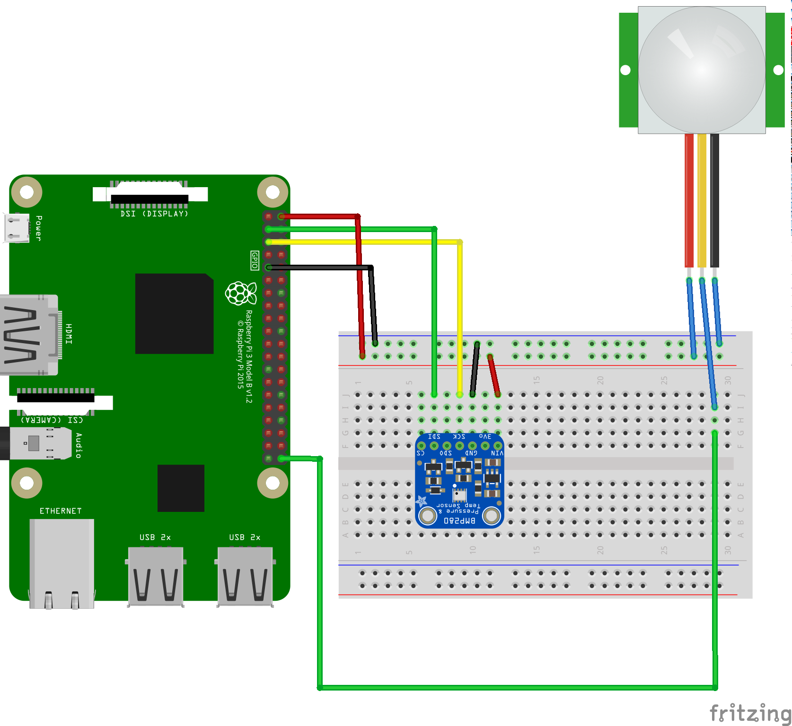

Android Things Cloud IoT Sensor Hub
===================================

This demo shows how to implement a sensor hub on Android Things that collects
sensor data from connected sensors and publish on a
Google Cloud IoT PubSub topic.

- connection parameters are configurable via intent and configuration is saved in sharedpreferences
- sensor robustness: you can remove and add sensors at runtime and the app will adapt accordingly
- network robustness: device can loose connectivity. When connectivity is restored, it will auto-reconnect
- power robustness: device can loose power. When is reboots, it will auto-reconnect
- sensor data collected since the last publish is sent to pubsub every 20 seconds
- sensor data is collected either as continuous mode or onchange mode. Continuous mode sensors
(temperature and pressure) publishes only the most recent value. Onchange mode
sensors (motion detection) stores up to 10 sensor changes in between pubsub publications.

Pre-requisites
--------------
- Android Things compatible board
- Android Studio 2.2+
- 1 [bmp280 temperature and pressure](https://www.adafruit.com/product/2651)
- 1 [PIR motion detector sensor](https://www.adafruit.com/product/189)
- [Google Cloud Platform](https://cloud.google.com/) project with Cloud IoT support

Schematics
----------




Build and install
=================

On Android Studio, click on the "Run" button.
If you prefer to run on the command line, type
```
./gradlew installDebug
adb shell am start com.example.androidthings.sensorhub/.SensorHubActivity
```

Prepare the device
==================

This sample will create a key pair (private and public) on the device on the
first run. The private key will be saved to the Android Keystore, using a
secure hardware if one is available. The public key will be printed to logcat
and will be available as a file on your external storage location.

You will need the public key to register your device to Google Cloud IoT. Here's
how you can fetch it:

```
adb pull /sdcard/cloud_iot_auth_certificate.pem
```

or, depending on your platform:

```
adb -d shell "run-as com.example.androidthings.sensorhub cat /data/user/0/com.example.androidthings.sensorhub/files/cloud_iot_auth_certificate.pem" > cloud_iot_auth_certificate.pem
```

A new keypair is only generated again when the device is reflashed.

Register the device
-------------------

With the `cloud_iot_auth_certificate.pem` file, you can register your device on
Google Cloud IoT:

```
gcloud beta iot devices create <DEVICE_ID> --project=<PROJECT_ID> --region=<CLOUD_REGION> --registry=<REGISTRY_ID> --public-key path=cloud_iot_auth_certificate.pem,type=rs256
```

Where:
- `DEVICE_ID`: your device ID (it can be anything that identifies the device for you)
- `PROJECT_ID`: your Cloud IoT project id
- `CLOUD_REGION`: the cloud region for project registry
- `REGISTRY_ID`: the registry name where this device should be registered

Configure the device
--------------------

Now that your device's public key is regsitered to Google Cloud IoT, you can set
the device so that it can publish the sensor data to the Cloud IoT MQTT:

```
adb shell am startservice -a com.example.androidthings.sensorhub.mqtt.CONFIGURE -e project_id <PROJECT_ID> -e cloud_region <CLOUD_REGION> -e registry_id <REGISTRY_ID> -e device_id <DEVICE_ID> com.example.androidthings.sensorhub/.cloud.CloudPublisherService
```

Next steps
----------

If the registration and configuration steps were executed successfully, your
device will immediately start to publish sensor data to Google Cloud IoT.

Take a look at the [Google Cloud IoT documentation](https://cloud.google.com/iot/) to learn how to pipe the
data published by your devices into the other Google Cloud services.


License
-------
Copyright 2016 The Android Open Source Project, Inc.
Licensed to the Apache Software Foundation (ASF) under one or more contributor
license agreements.  See the NOTICE file distributed with this work for
additional information regarding copyright ownership.  The ASF licenses this
file to you under the Apache License, Version 2.0 (the "License"); you may not
use this file except in compliance with the License.  You may obtain a copy of
the License at
  http://www.apache.org/licenses/LICENSE-2.0
Unless required by applicable law or agreed to in writing, software
distributed under the License is distributed on an "AS IS" BASIS, WITHOUT
WARRANTIES OR CONDITIONS OF ANY KIND, either express or implied.  See the
License for the specific language governing permissions and limitations under
the License.
